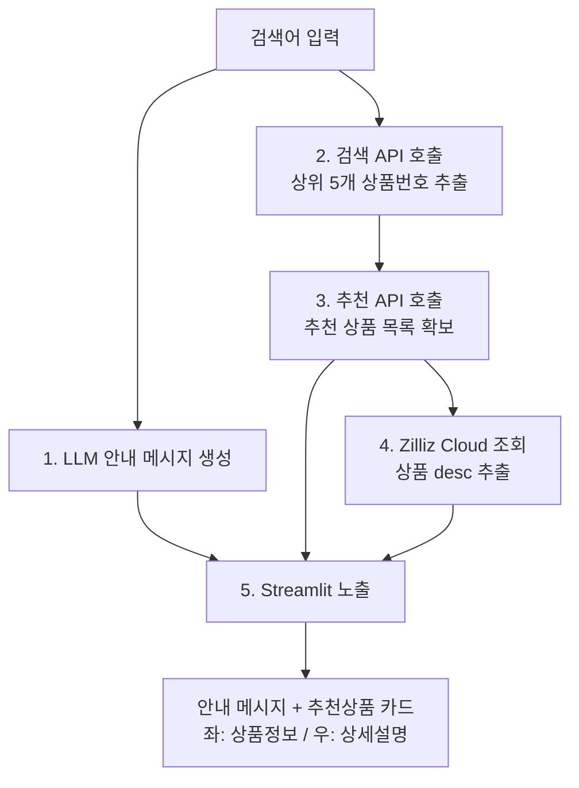

# 개발지시서 — 검색어 기반 LLM 추천 안내 & 추천상품 상세 노출 (Streamlit PoC)

| 항목 | 내용 |
|------|------|
| 문서 버전 | v1.0 |
| 작성 기준 | AX팀 / Halfclub |
| 목적 | 검색어를 입력받아 LLM 트렌드 안내 메시지를 생성하고, 검색·추천 API와 Zilliz Cloud를 연계하여 추천상품 상세설명을 노출하는 PoC 구현 |
| 결과물 | Streamlit 기반 테스트 화면 (단일 파일 실행 가능) |

---

## 1. 개요

검색어 1건을 입력받아 아래 5단계를 순차 실행하는 PoC를 구현한다.

1. LLM이 검색어를 해석하여 **최신 트렌드 기반 추천 상품군 안내 메시지**를 생성
2. **검색 API**로 검색결과 상위 5개 상품번호 추출
3. 추출된 5개 상품번호를 시드로 **추천 API** 호출 → 추천 상품 목록 확보
4. 추천 상품번호로 **Zilliz Cloud**에서 상품 `desc` 조회
5. **Streamlit** 화면에 추천상품을 1행 1상품으로 노출 (좌: 주요 상품정보 / 우: 상세설명)

---

## 2. 처리 흐름



---

## 3. 단계별 상세 명세

### STEP 1. LLM 트렌드 안내 메시지 생성

**목적**: 검색어를 입력받아 고객에게 "어떤 상품군을 추천받게 되는지"를 최신 트렌드 관점에서 간략히 안내하는 메시지 생성.

**입력**: 검색어(string)

**처리**
- 사내 LiteLLM 프록시 경유로 호출 (모델은 `.env`로 분기, 기본 Claude 또는 z.ai GLM)
- 안내 메시지는 **2~4문장 / 한국어 / 과장 광고성 표현 배제** 가이드 적용
- 응답은 마크다운 없이 순수 텍스트로 받아 그대로 노출

**프롬프트 설계 가이드 (system)**
```
당신은 패션 이커머스 큐레이터입니다.
사용자가 입력한 검색어에 대해, 현재 시즌·트렌드 관점에서
추천하게 될 상품군을 2~4문장으로 간결하게 안내하세요.
- 특정 브랜드/가격을 단정하지 말 것
- 과장·확정 표현(최고, 무조건 등) 사용 금지
- 한국어 평서문, 마크다운/이모지 미사용
```

**호출 예시**
```python
import os, requests

def make_guide_message(keyword: str) -> str:
    resp = requests.post(
        f"{os.environ['LITELLM_BASE_URL']}/v1/messages",
        headers={"x-api-key": os.environ["LITELLM_API_KEY"]},
        json={
            "model": os.environ.get("GUIDE_MODEL", "gpt-4o-mini"),
            "max_tokens": 400,
            "system": SYSTEM_PROMPT,
            "messages": [{"role": "user", "content": f"검색어: {keyword}"}],
        },
        timeout=20,
    )
    data = resp.json()
    return "".join(b["text"] for b in data["content"] if b["type"] == "text")
```

**출력**: 안내 메시지(string). 실패 시 빈 메시지로 폴백하고 화면에 "안내 생성 실패" 처리(추천 흐름은 계속 진행).

---

### STEP 2. 검색 API — 상위 5개 상품번호 추출

**엔드포인트**
```
GET https://hapix.halfclub.com/searches/prdList/?keyword={검색어}&device=pc&limit=0,5&sortSeq=12
```

**파라미터**

| 파라미터 | 값 | 설명 |
|----------|-----|------|
| `keyword` | 검색어 (URL 인코딩 필수) | 한글은 `urllib.parse.quote` 처리 |
| `device` | `pc` | 고정 |
| `limit` | `0,5` | `offset,count` 형식 → offset 0부터 5개 |
| `sortSeq` | `12` | 정렬 시퀀스(현행 운영값) |

**처리**
- 응답 JSON에서 상위 5개 상품의 **상품번호(prdNo)** 리스트 추출
- ⚠️ 응답 스키마의 prdNo JSON 경로는 실제 응답으로 확정 필요 (예상: 상품 배열 내 `prdNo` 키). 구현 시 1건 호출하여 실제 키 확인 후 파서 고정.

**출력**: `seed_prd_list = [prdNo1, prdNo2, prdNo3, prdNo4, prdNo5]`

**예외**
- 검색결과 0건 → STEP 1 안내 메시지만 노출, 추천 영역 "검색결과 없음" 표기
- 5건 미만 → 확보된 건수만 시드로 사용

---

### STEP 3. 추천 API — 추천 상품 목록 조회

**엔드포인트**
```
GET https://hapix.halfclub.com/recommend/home?prdNo={상품번호1}&prdNo={상품번호2}&...&size=24&countryCd=001&langCd=001&siteCd=1&deviceCd=001
```

**파라미터**

| 파라미터 | 값 | 설명 |
|----------|-----|------|
| `prdNo` | STEP 2의 상품번호 (다중) | `prdNo`를 5개 반복 부여 |
| `size` | `24` | 추천 결과 최대 건수 |
| `countryCd` | `001` | 고정 |
| `langCd` | `001` | 고정 |
| `siteCd` | `1` | 고정 |
| `deviceCd` | `001` | 고정 |

**다중 prdNo 쿼리 구성**
```python
from urllib.parse import urlencode

params = [("prdNo", p) for p in seed_prd_list]
params += [("size", 24), ("countryCd", "001"), ("langCd", "001"),
           ("siteCd", "1"), ("deviceCd", "001")]
url = "https://hapix.halfclub.com/recommend/home?" + urlencode(params)
```

**처리**
- 응답에서 추천 상품의 **상품번호 + 주요 상품정보**(상품명, 브랜드, 가격, 썸네일 URL 등) 추출
- 화면 좌측에 노출할 "주요 상품정보"의 출처는 본 추천 API 응답을 기준으로 함
- ⚠️ 실제 응답 필드명(상품명/가격/이미지 키) 확정 필요. 구현 시 매핑 테이블 고정.

**출력**: 추천 상품 객체 리스트
```python
[{ "prdNo": ..., "prdName": ..., "brand": ..., "price": ..., "imageUrl": ... }, ...]
```

---

### STEP 4. Zilliz Cloud — 상품 desc 조회

**목적**: STEP 3의 추천 상품번호로 Zilliz Cloud 컬렉션에서 상품 상세설명(`desc`) 조회.

**연결 정보 (.env)**
```
ZILLIZ_URI=...        # Zilliz Cloud Public Endpoint
ZILLIZ_TOKEN=...      # API Key 또는 user:password
ZILLIZ_COLLECTION=... # 상품 컬렉션명
```

**조회 로직**
```python
from pymilvus import MilvusClient

client = MilvusClient(uri=ZILLIZ_URI, token=ZILLIZ_TOKEN)

prd_nos = [p["prdNo"] for p in rec_products]
rows = client.query(
    collection_name=ZILLIZ_COLLECTION,
    filter=f"prdNo in {prd_nos}",      # prdNo 스칼라 필드 기준 필터
    output_fields=["prdNo", "desc"],   # 필요 필드만 명시
    limit=len(prd_nos),
)
desc_map = {r["prdNo"]: r.get("desc", "") for r in rows}
```

**고려사항**
- `prdNo` 필드가 컬렉션 스키마에 스칼라(예: INT64/VARCHAR)로 존재하고 필터 가능해야 함. 타입 불일치 시 `filter` 표현식 수정 (문자열이면 `prdNo in ["...","..."]`).
- 추천 상품번호 중 Zilliz에 미적재된 건은 `desc` 공란 처리 (화면에 "상세설명 없음" 표기).
- 조회는 벡터 검색이 아닌 **스칼라 필터 query**로 수행 (유사도 검색 아님).

**출력**: `desc_map = { prdNo: desc }`

---

### STEP 5. Streamlit 화면 구현

**레이아웃 요구사항**
- 상단: STEP 1 LLM 안내 메시지 영역
- 추천 상품 목록: **1행 1상품**
  - **좌측 컬럼**: 주요 상품정보 (썸네일, 상품명, 브랜드, 가격, 상품번호)
  - **우측 컬럼**: 상세설명(`desc`)
- 상품 간 구분선(divider) 적용

**컬럼 비율 권장**: `st.columns([1, 2])` (좌 1 : 우 2) — 상세설명 가독성 우선.

**구현 골격**
```python
import streamlit as st

st.title("검색어 기반 추천 PoC")

keyword = st.text_input("검색어", "원피스")
if st.button("실행") and keyword:
    # STEP 1
    guide = make_guide_message(keyword)
    st.subheader("추천 안내")
    st.write(guide or "안내 메시지를 생성하지 못했습니다.")

    # STEP 2~4
    seed = get_top5_prd(keyword)
    rec_products = get_recommend(seed)
    desc_map = get_desc_from_zilliz([p["prdNo"] for p in rec_products])

    # STEP 5
    st.subheader("추천 상품")
    if not rec_products:
        st.info("검색/추천 결과가 없습니다.")
    for p in rec_products:
        col_l, col_r = st.columns([1, 2])
        with col_l:
            if p.get("imageUrl"):
                st.image(p["imageUrl"], width=160)
            st.markdown(f"**{p.get('prdName','')}**")
            st.caption(p.get("brand", ""))
            st.write(f"가격: {p.get('price','')}")
            st.caption(f"상품번호: {p['prdNo']}")
        with col_r:
            st.markdown(desc_map.get(p["prdNo"]) or "_상세설명 없음_")
        st.divider()
```

---

## 4. 환경 / 의존성

**.env 항목**
```
LITELLM_BASE_URL=
LITELLM_API_KEY=
GUIDE_MODEL=gpt-4o-mini
ZILLIZ_URI=
ZILLIZ_TOKEN=
ZILLIZ_COLLECTION=
```

**requirements.txt**
```
streamlit
requests
pymilvus
python-dotenv
```

**실행**
```
streamlit run app.py
```

---

## 5. 예외 / 운영 고려사항

| 구분 | 처리 방침 |
|------|-----------|
| 한글 검색어 인코딩 | `urllib.parse.quote` 필수 적용 |
| 검색결과 0건 | 안내 메시지만 노출, 추천 영역 빈 상태 안내 |
| 추천 API 응답 필드 | 구현 전 1건 실호출로 스키마 확정 후 매핑 고정 |
| Zilliz 미적재 상품 | desc 공란 → "상세설명 없음" 노출 |
| API 타임아웃 | 각 호출 timeout 지정(검색/추천 10s, LLM 20s) |
| LLM 호출 실패 | 추천 흐름은 계속, 안내 영역만 폴백 |
| 캐싱(선택) | 동일 검색어 반복 테스트 대비 `st.cache_data` 적용 검토 |

---

## 6. 개발 단계 체크리스트

- [ ] 검색 API 1건 실호출 → prdNo JSON 경로 확정
- [ ] 추천 API 1건 실호출 → 상품정보 필드 매핑 확정
- [ ] Zilliz 컬렉션 스키마 확인 (`prdNo` 필터 가능 여부, `desc` 필드명)
- [ ] STEP 1 LLM 안내 메시지 모듈 구현·검증
- [ ] STEP 2~4 데이터 파이프라인 연결
- [ ] STEP 5 Streamlit 레이아웃(좌/우 분할) 구현
- [ ] 예외 케이스(0건/미적재/타임아웃) 동작 확인
- [ ] 전체 플로우 통합 테스트 (검색어: 원피스 등)

---

## 7. 확정 필요 항목 (개발 착수 전 협의)

1. 검색 API 응답에서 상품번호(prdNo)의 정확한 JSON 경로
2. 추천 API 응답의 상품명·브랜드·가격·이미지 필드명
3. Zilliz 컬렉션명, `prdNo` 필드 타입(정수/문자열), `desc` 필드명
4. LLM 안내 메시지 사용 모델 (Claude vs z.ai GLM) 및 톤 가이드 최종안
